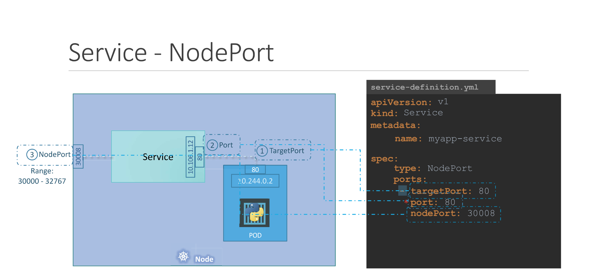

# Certified Kubernetes Administrators Certification

https://kubernetes.io/docs/reference/kubectl/cheatsheet/
https://kubernetes.io/docs/tasks/


```
alias k=kubectl
complete -F __start_kubectl k
```
``` 
#For bash
source <(kubectl completion bash) # setup autocomplete in bash into the current shell, bash-completion package should be installed first.
echo "source <(kubectl completion bash)" >> ~/.bashrc # add autocomplete permanently to your bash shell.
```

``` 
#For zsh
source <(kubectl completion zsh)  # setup autocomplete in zsh into the current shell
echo "[[ $commands[kubectl] ]] && source <(kubectl completion zsh)" >> ~/.zshrc # add autocomplete permanently to your zsh shell
```

## Chapter Core concepts

### Documentation links

- https://kubernetes.io/docs/reference/kubernetes-api/workload-resources/
- https://kubernetes.io/docs/concepts/workloads/controllers/
- https://kubernetes.io/docs/concepts/workloads/pods/

### Resources




### Important commands

- `k run nginx --image=nginx --port=80`
- `k set image pod nginx nginx=nginx:alpine`
- `k expose pod nginx --type=NodePort --port=80 --target-port=80 # Cant provide the node port`

- `k expose pod nginx --type=NodePort --port=80 --target-port=80 --dry-run=client -o yaml`
- `k expose pod nginx --type=LoadBalancer --port=80 --target-port=80`
- `k create deploy nginx --image=nginx  --replicas=3  --port=80 --dry-run=client -o yaml`

## Chapter Scheduling

### Documentation links

- https://kubernetes.io/docs/concepts/scheduling-eviction/taint-and-toleration/
- https://kubernetes.io/docs/concepts/scheduling-eviction/assign-pod-node/#affinity-and-anti-affinity
- https://kubernetes.io/docs/concepts/scheduling-eviction/assign-pod-node/
- https://kubernetes.io/docs/tasks/extend-kubernetes/configure-multiple-schedulers/#:~:text=Specify%20schedulers%20for%20pods,scheduler%20in%20that%20pod%20spec.

### Resources


- `k get pods --selector env=dev`
- `k get all --selector env=dev` # Doesnt show the replicaset
- `k get pod --selector env=prod,bu=finance,tier=frontend`
- `k taint node nodename key=value:taint-effect` #taint-effect: NoSchedule, NoExecute, PreferNoSchedule
No such imperative command for pod toleration
- `k label nodes node1 size=large` # Drawback Single label or selector is possible

## Chapter logging and monitoring